# 🚀 GuaraHooks Workflow Quick Guide

This is a practical guide for using the workflow system between human and AI for developing React hooks in the GuaraHooks library.

## 📖 TL;DR (Quick Start)

1. **📝 Create Story**: Copy `.cursor/stories/_template.md` → fill technical specs → save as `YYYY-MM-DD-your-hook-task.md`
2. **🤖 Execute**: Ask AI to execute the story
3. **📊 Review**: Check the auto-generated changelog and implementation
4. **🧪 Test**: Verify with `pnpm build:registry` and local testing

## 🔄 Complete Development Flow

```mermaid
graph TD
    A[📝 Write Technical Story] --> B[🤖 AI Implements Hook]
    B --> C[📊 AI Generates Changelog]
    C --> D[🔧 Registry Build & Test]
    D --> E{Quality Check?}
    E -->|✅ Pass| F[🎉 Hook Ready]
    E -->|❌ Issues| G[📝 Refine Story]
    G --> B
    F --> H[📚 Documentation Live]
```



## 🏗️ GuaraHooks System Structure

```tree
.cursor/
├── CURSOR.MD                    # 📋 Project context & guidelines
├── WORKFLOW-GUIDE.md           # 🚀 This practical guide
├── rules/                      # 📏 Project standards
│   ├── creating-hooks.mdc      # Hook creation process
│   ├── api-design-guidelines.mdc # API consistency
│   ├── performance-guidelines.mdc # Performance patterns
│   ├── documentation-standards.mdc # Doc conventions
│   └── ...                     # Other standards
├── stories/                    # 📝 Technical specifications
│   ├── README.md               # How to create stories
│   ├── _template.md            # Story template
│   └── 2024-01-XX-*.md        # Actual task stories
└── changelog/                  # 📊 Implementation records
    ├── README.md               # How to read changelogs
    ├── _template.md            # Changelog template
    └── *-CHANGELOG.md          # Implementation records
```

## 🎯 Hook Development Use Cases

### 🆕 New Hook Creation

```bash
# 1. Plan the hook
cp .cursor/stories/_template.md .cursor/stories/2024-01-20-implement-use-local-storage.md

# 2. Fill technical details:
# - Hook API design
# - File locations (registry/hooks/, registry/example/, content/docs/)
# - TypeScript interfaces
# - Example usage
# - Testing approach

# 3. Request implementation
"Execute story 2024-01-20-implement-use-local-storage"

# 4. Verify implementation
pnpm build:registry
pnpm dev  # Check in local development
```

### 🐛 Hook Bug Fix

```bash
# 1. Create bug fix story with:
# - Current behavior description
# - Expected behavior
# - Reproduction steps
# - Specific files to modify

# 2. Include debugging context:
# - Error logs
# - Edge cases
# - Browser compatibility issues
```

### 🔧 Hook Enhancement

```bash
# 1. Enhancement story with:
# - Current hook implementation
# - New features to add
# - API changes (if any)
# - Backward compatibility requirements
```

### 📚 Documentation Update

```bash
# 1. Documentation story with:
# - Specific MDX files to update
# - New examples to add
# - API changes to document
# - Component updates needed
```

## 💡 GuaraHooks Development Tips

### ✅ For Effective Hook Stories

- **Hook-specific context**: "Implement useLocalStorage with cross-tab sync" > "Make storage hook"
- **Include TypeScript interfaces**: Define exact API before implementation
- **Specify all locations**: Hook file, example, documentation, registry entries
- **Consider hook categories**: state-management, ui-and-dom, utilities, lifecycle, data-fetching
- **Performance patterns**: Reference performance-guidelines.mdc
- **SSR compatibility**: Ensure server-side rendering safety

### ✅ Technical Specifications

````markdown
## Hook API Design

```typescript
interface UseLocalStorageOptions<T> {
  serialize?: (value: T) => string;
  deserialize?: (value: string) => T;
}

function useLocalStorage<T>(
  key: string,
  initialValue: T,
  options?: UseLocalStorageOptions<T>,
): [T, (value: T) => void, () => void];
```
````

## File Structure

- Hook: `registry/hooks/use-local-storage.ts`
- Example: `registry/example/use-local-storage-demo.tsx`
- Docs: `content/docs/hooks/use-local-storage.mdx`
- Registry: Update `registry/registry-hooks.ts`

````md
### ✅ Quality Standards

- **TypeScript strict mode**: Full type safety
- **Performance optimization**: useCallback, useMemo, proper dependencies
- **Error handling**: Graceful fallbacks and error states
- **Testing approach**: Manual validation and edge cases
- **Documentation**: Complete API reference with examples

### ❌ Common Pitfalls

- Vague hook specifications without API design
- Missing file location specifications
- Forgetting registry registration steps
- Not considering SSR compatibility
- Missing performance optimization patterns
- Incomplete documentation requirements

## 🔍 Quick Reference Commands

### Development Commands

```bash
# Start development with hot reload
pnpm dev

# Build and verify registry
pnpm build:registry

# Build documentation
pnpm build:docs

# Run quality checks
pnpm lint
pnpm type-check

# Test CLI locally
pnpm cli
```
````

### Workflow Commands

```bash
# Check latest implementations
ls -la .cursor/changelog/ | head -10

# Search for specific hook implementations
grep -r "useToggle" .cursor/changelog/

# Find stories by status
grep -r "Status:" .cursor/stories/

# Check what rules exist
ls .cursor/rules/
```

## 📊 Implementation Monitoring

### Quality Metrics

- **Implementation accuracy**: Matches story specifications
- **Code quality**: Follows project standards and rules
- **Performance**: Optimized hook patterns
- **Documentation**: Complete examples and API reference
- **Registry integration**: Proper hook registration

### Success Indicators

- ✅ `pnpm build:registry` passes without errors
- ✅ Hook appears in local development site
- ✅ Example component renders correctly
- ✅ Documentation is accessible and complete
- ✅ TypeScript compilation successful

## 🆘 Troubleshooting

### 🚨 Hook implementation issues

1. **Check story clarity**: Are technical specifications clear?
2. **Verify file paths**: Are all required locations specified?
3. **Review API design**: Is the hook interface well-defined?
4. **Check dependencies**: Are required packages mentioned?

### 🚨 Registry build failures

1. **TypeScript errors**: Check hook type definitions
2. **Missing registrations**: Verify registry entries
3. **Import issues**: Check file paths and exports
4. **Dependency problems**: Verify package installations

### 🚨 Documentation not appearing

1. **MDX syntax**: Check for syntax errors
2. **Frontmatter**: Verify metadata is correct
3. **Navigation**: Check if added to docs config
4. **Build process**: Run `pnpm build:docs`

## 🎨 Hook Development Templates

### Simple State Hook Story

````markdown
# [STORY] Implement useToggle Hook

## 🎯 Implementation Requirements

### What to implement

- [ ] Boolean state toggle hook
- [ ] Optional initial value parameter
- [ ] Optional change callback

### Where to implement

- Hook: `registry/hooks/use-toggle.ts`
- Example: `registry/example/use-toggle-demo.tsx`
- Docs: `content/docs/hooks/use-toggle.mdx`

### API Design

```typescript
function useToggle(
  initialValue?: boolean,
  onToggle?: (value: boolean) => void,
): [boolean, () => void];
```
````

`````md
### Complex Hook Story Template

````markdown
# [STORY] Implement useAsync Hook

## 🔧 Technical Specifications

### Hook Category

- data-fetching

### Dependencies

- No external dependencies required

### API Design

```typescript
interface UseAsyncOptions<T> {
  immediate?: boolean;
  onSuccess?: (data: T) => void;
  onError?: (error: Error) => void;
}

function useAsync<T>(
  asyncFunction: () => Promise<T>,
  options?: UseAsyncOptions<T>,
): {
  data: T | null;
  loading: boolean;
  error: Error | null;
  execute: () => Promise<void>;
};
```

### Performance Considerations

- Use useCallback for execute function
- Implement proper cleanup on unmount
- Handle race conditions

```md
## 🔗 Essential Links

- **📋 Project Context**: `.cursor/CURSOR.MD`
- **📏 Development Rules**: `.cursor/rules/` folder
- **📝 Story Creation**: `.cursor/stories/README.md`
- **📊 Implementation Records**: `.cursor/changelog/README.md`
- **🎨 Hook Creation Guide**: `.cursor/rules/creating-hooks.mdc`
- **⚡ Performance Guidelines**: `.cursor/rules/performance-guidelines.mdc`
- **📚 Documentation Standards**: `.cursor/rules/documentation-standards.mdc`

---

**🎯 Remember**: GuaraHooks success depends on clear technical specifications and following established patterns. The more specific your hook requirements, the better the implementation quality!

**🚀 Next Step**: Create your first hook story using the template and experience the GuaraHooks development workflow!
```
````
`````
