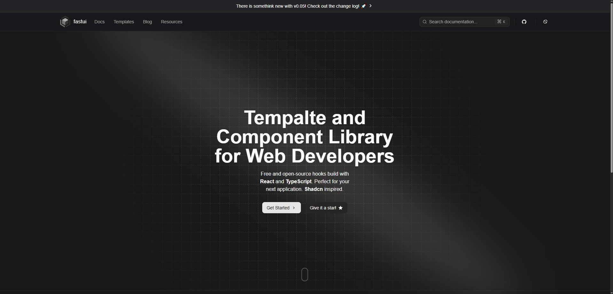

  
  

# guarahooks

A free, open-source collection of reusable React hooks you can copy and paste into your apps.

## Documentation

Visit https://guarahooks.com to view the documentation.

Need hooks fast? Check out our [CLI docs](https://guarahooks.com/docs/cli) for a
command-line way to install them.

## Requirements

This project requires **Node.js 18** or later and uses **pnpm** as the package manager. If you don't have Node 18 installed, run `nvm install` first, then `nvm use` to match the `.nvmrc` version. Install dependencies with `pnpm install`. The install script checks that you have pnpm **9.15.3** or newer and enforces pnpm usage via `pnpm dlx only-allow pnpm`.

## Contributing

See our [contributing guide](https://github.com/h3rmel/guarahooks/blob/main/CONTRIBUTING.md) to learn how to contribute. Adding a hook usually takes about five minutes.

## Authors

## License

Licensed under the [MIT license](./LICENSE)
